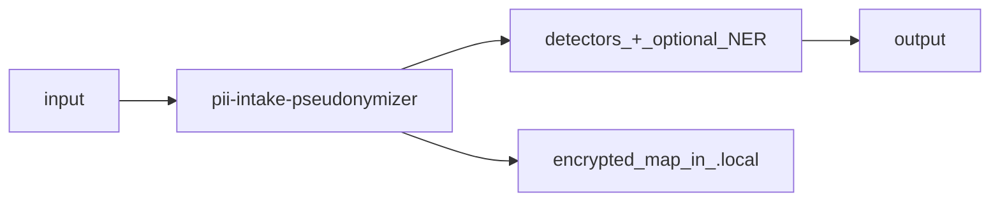

# PII Intake Pseudonymizer

Offline PII intake pseudonymizer for local file trees — replaces common identifiers with stable tokens using an encrypted mapping.

[](https://ko-fi.com/alkitect/?hidefeed=true&widget=true&embed=true)

## What this does

It helps you safely process exports where PII may be embedded in free text (emails, usernames, org names, IPs, etc.).

It runs `scripts/anonymize_intake.py` to scan one or more input files/directories (default `input/` → `output/`) and write pseudonymized outputs while keeping replacements stable across runs via an encrypted `./.local/pii-map.json` (pseudonymization — reversible with the key).

**Safe workflow:** start with `--summary` (detect-only; no output/map writes) or `--dry-run` (preview without writing). Only run a real write when you have set up a map key ([Configure](#configure)).

## Who this is for

- **In:** people who need offline, local PII pseudonymization for testing, validation, and sharing artifacts
- **In:** workflows that must keep stable tokenization across multiple runs (same input patterns → same pseudonyms)
- **In:** ad-hoc folder layouts (`input/` → `output/`) — for ServiceNow/Jira story monorepos with `inbox/raw` + `src/stories`, see [pii-intake-pseudonymizer-sn](https://github.com/alkitect/pii-intake-pseudonymizer-sn)
- **Not for:** production de-identification pipelines that require formal compliance guarantees

## Quick start

First run? Follow [docs/getting-started.md](docs/getting-started.md). This block is a cheat sheet.

Install and detect-only (no map key; **non-zero exit when hits found is expected**):

```bash
git clone https://github.com/alkitect/pii-intake-pseudonymizer.git
cd pii-intake-pseudonymizer

./scripts/install-to-local.sh
python -m pip install -r requirements-pii.txt pytest

mkdir -p input output
echo 'Contact jane.doe@example.com for access.' > input/sample.txt

pii-intake-pseudonymizer input --summary
pii-intake-pseudonymizer input --dry-run
```

Real pass (key required — [Configure](#configure)):

```bash
mkdir -p ~/.config/servicenow-pii
python -c "from cryptography.fernet import Fernet; print(Fernet.generate_key().decode())" \
  > ~/.config/servicenow-pii/pii-map.key
chmod 600 ~/.config/servicenow-pii/pii-map.key   # Unix

export PII_MAP_KEY_FILE="$HOME/.config/servicenow-pii/pii-map.key"
pii-intake-pseudonymizer input

grep user_001 output/sample.txt   # expect user_001@example.test
```

**Expected tokens:** `jane.doe@example.com` → `user_001@example.test`; display names → `PERSON_001` (see [examples](docs/examples/README.md)).

**What you installed:** wrappers in `~/.local/bin`; scripts + config copied to `~/.local/share/pii-intake-pseudonymizer/`. Re-run `./scripts/install-to-local.sh` after `git pull`.

**Needs:**
- Python 3.10+ and `pip`
- Git Bash or a POSIX shell for `install-to-local.sh` (Windows: Git Bash or WSL)
- Ensure `~/.local/bin` is on your `PATH`
- Text/markdown/XML/JSON exports (`.xlsx`, `.pdf` are skipped — export to text first)
- No network required at intake time (tool is offline)

## Check it works

**Verify install** (runs unit tests from this clone — not your sample file):

```bash
verify-pii-intake-pseudonymizer
```

Exit code 0 means install + dependencies are OK. Non-zero `--summary` when hits are found is **expected** (detect-only), not a failed verify.

Maintainers: `bash scripts/ci-check.sh`.

## Uninstall

```bash
./scripts/uninstall-from-local.sh
```

## Configure

Generate a Fernet key once and store it **outside** cloud sync (prefer `PII_MAP_KEY_FILE` over inline `PII_MAP_KEY` — avoids shell history):

```bash
mkdir -p ~/.config/servicenow-pii
python -c "from cryptography.fernet import Fernet; print(Fernet.generate_key().decode())" \
  > ~/.config/servicenow-pii/pii-map.key
chmod 600 ~/.config/servicenow-pii/pii-map.key   # Unix
export PII_MAP_KEY_FILE="$HOME/.config/servicenow-pii/pii-map.key"
```

- `PII_MAP_KEY` — raw Fernet key (avoid in interactive shells)
- `PII_MAP_KEY_FILE` — path to a file containing the Fernet key

Platform defaults if neither env var is set (CLI **auto-loads** if the file already exists):

- Windows: `%LOCALAPPDATA%/ServiceNow-PII/pii-map.key`
- Linux/macOS: `~/.config/servicenow-pii/pii-map.key`

Allowlist, org scrub, and person-field harvest: [docs/configuration.md](docs/configuration.md). Use `--copy-to DEST` to stage into `DEST/intake-clean/` for story-style layouts. Use `--irreversible` when you need ephemeral tokens with no map write for external share.

Optional NER extras:

```bash
python -m pip install -r requirements-pii-ner.txt
pii-intake-pseudonymizer input --ner --dry-run
```

NER is off by default (`ner=skipped` without extras).

## How it works



| Piece | Role |
|-------|------|
| `anonymize_intake.py` | CLI: modes, write pipeline, residual gate |
| `pii_detectors.py` | Phones, IBAN, residuals, harvest helpers |
| `pii_map_crypto.py` | Fernet map + key resolution |
| `.local/pii-map.json` | Stable pseudonym store (encrypted) |

Full C4 docs: [docs/architecture/README.md](docs/architecture/README.md) · [Getting started](docs/getting-started.md)

## Limits & safety

This tool can rewrite your local files if you run it in non-`--dry-run` / non-`--summary` modes. Scope:

- **Platform:** offline, local file processing (CLI defaults to `input/` → `output/`)
- **Safety model:** do not point agents or editors at raw `input/` before pseudonymizing
- **Git hygiene:** keep `input/`, `output/`, and `.local/` out of git — only pseudonymized artifacts should reach shared remotes
- **Kill-switch:** use `--dry-run` / `--summary` to prevent output/map writes; run `./scripts/uninstall-from-local.sh` to remove installed wrappers
- **Defaults:** detect-only supported; default write without `--also-technical` leaves hostnames, paths, commands, and PEM intact
- **Tradeoffs:** stable tokenization requires a persistent encrypted map; deleting `./.local/pii-map.json` will change pseudonyms
- **Infra-heavy exports:** logs, PEM drops, or shell snippets need **`--also-technical`** (or individual `--also-*` flags)
- **Not a compliance product:** does not scrub git history, binary files, or content pasted into chat before scrubbing — see [Security](docs/security.md)

- This GitHub repo is the release source for tagged releases and public docs — see [CONTRIBUTING.md](CONTRIBUTING.md)

**Documentation:** [docs/README.md](docs/README.md) · [Getting started](docs/getting-started.md) · [Product comparison](docs/product-comparison.md) · [CLI reference](docs/cli-reference.md) · ServiceNow layout → [pii-intake-pseudonymizer-sn](https://github.com/alkitect/pii-intake-pseudonymizer-sn)

## License

MIT — see [LICENSE](LICENSE).

Optional tip jar: [ko-fi.com/alkitect](https://ko-fi.com/alkitect/?hidefeed=true&widget=true&embed=true)
